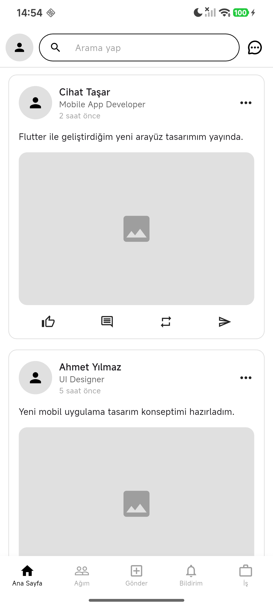
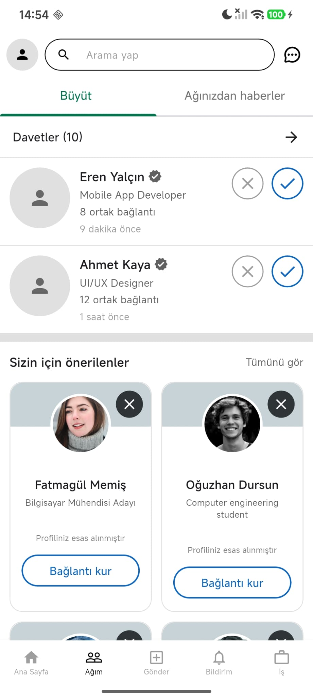
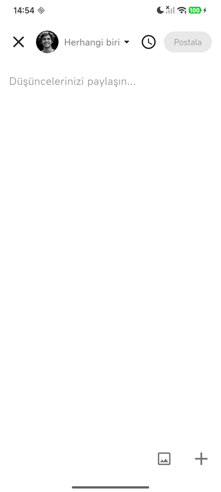
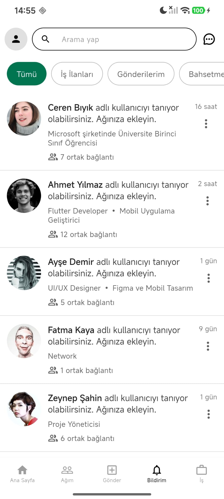
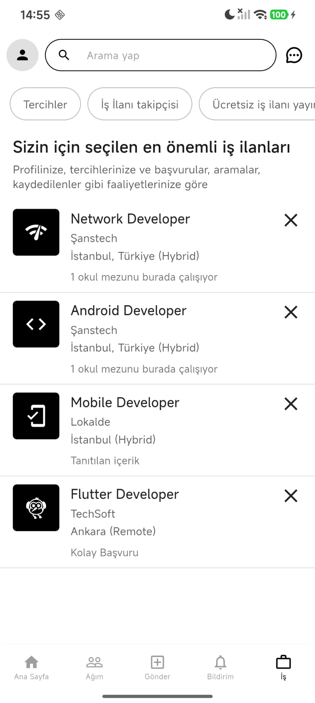

# LinkedIn Clone

Bu proje, Flutter kullanılarak geliştirilen bir LinkedIn mobil uygulama klonudur.  
Uygulama içerisinde ana sayfa akışı, ağım bölümü, gönder paylaşma ekranı, bildirimler ve iş ilanları sayfaları bulunmaktadır.

## Projenin Amacı

Bu projenin amacı Flutter kullanarak modern bir sosyal medya uygulaması arayüzü geliştirmek ve sayfalar arası geçiş yapısını öğrenmektir.

## Kullanılan Teknolojiler

- Flutter
- Dart
- Material Design

## Uygulama Özellikleri

- Ana sayfa paylaşım akışı
- Alt navigation bar yapısı
- Ağım sayfası
- Gönder paylaşma ekranı
- Bildirim sayfası
- İş ilanları sayfası
- Kaydırılabilir yapı
- Modern LinkedIn benzeri tasarım

## Bu Proje Hangi Uygulamanın Klonudur?

Bu proje, LinkedIn uygulamasının mobil arayüz tasarımından esinlenilerek geliştirilmiştir.

## Ekran Görüntüleri

### Ana Sayfa


### Ağım Sayfası


### Gönder Sayfası


### Bildirimler Sayfası


### İş İlanları Sayfası


---

# Projeyi Çalıştırma

```bash
flutter pub get
flutter run